# FMVA Financial Modeling Portfolio

A collection of financial models built as part of the **Financial Modeling & Valuation Analyst (FMVA)** certification by the Corporate Finance Institute (CFI). Models cover core FP&A and valuation skills including DCF, 3-statement modeling, benchmarking, and variance analysis.

> **Disclosure:** Model structures and guided assumptions provided by CFI. Financial analysis, formula implementation, and dashboard completion done independently.

---

## Models

### 1. DCF Valuation Model
Dual-method DCF (Perpetuity Growth + Exit Multiple) with WACC build, Best/Base/Worst scenario switching, and 5×5 sensitivity tables across WACC and terminal value assumptions.

- Base Case EV: $128,313K | Equity per Share: $3.21 | Premium to Market: +44%
- Best Case EV: $177,724K | Worst Case EV: $102,223K

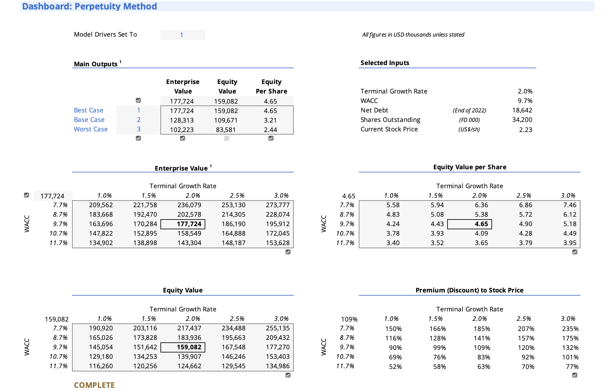
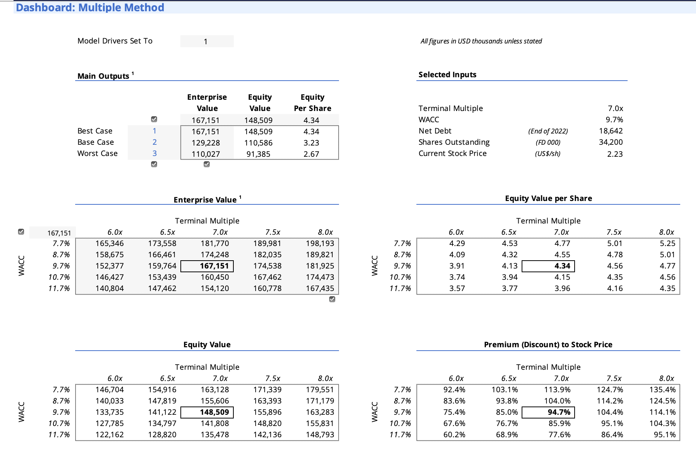

---

### 2. 3-Statement Model
Fully integrated Income Statement, Balance Sheet, and Cash Flow Statement with 3 years of actuals (2020A–2022A) and 5-year forecast (2023F–2027F), scenario driver switch, and automated charts dashboard.

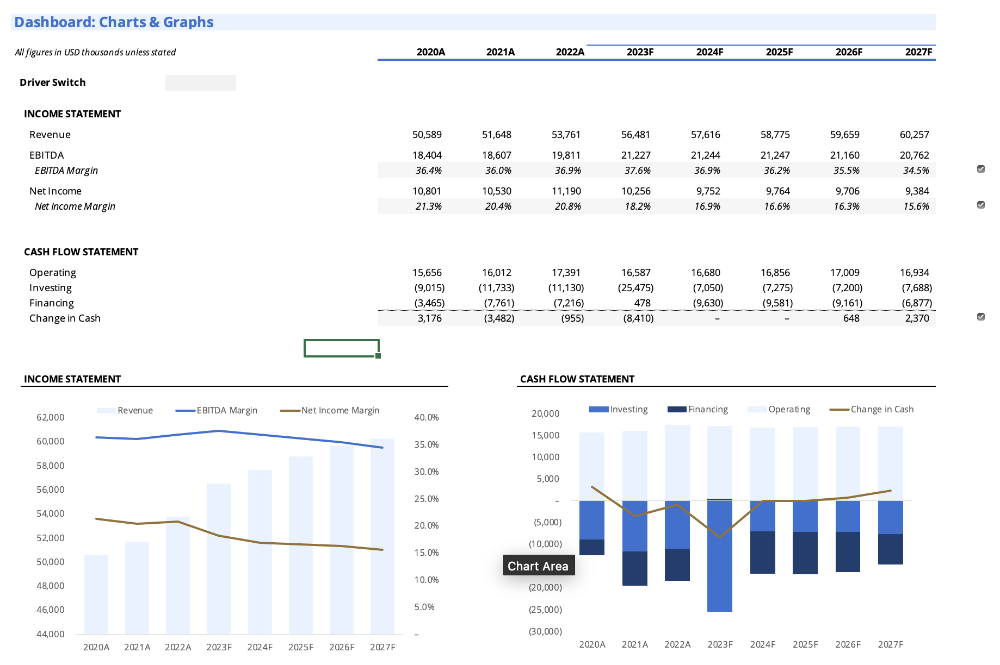

---

### 3. Benchmarking Analysis
Retail industry peer benchmarking across 8 years comparing a Large Retailer against Small, Mid-cap, and Industry averages across growth, liquidity, leverage, asset utilization, and profitability.

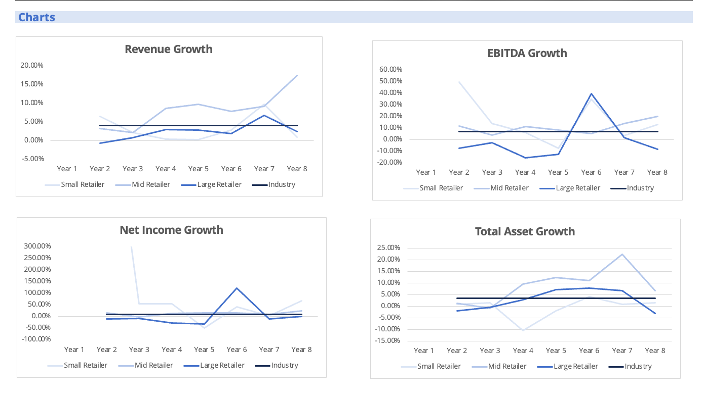
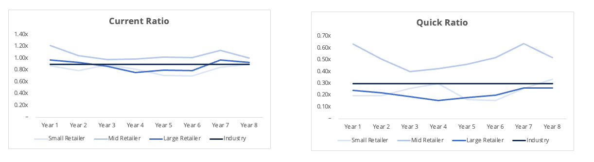
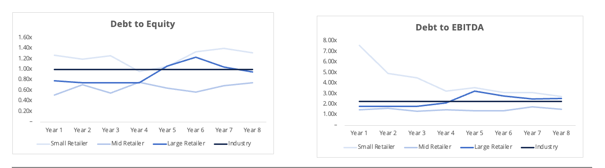
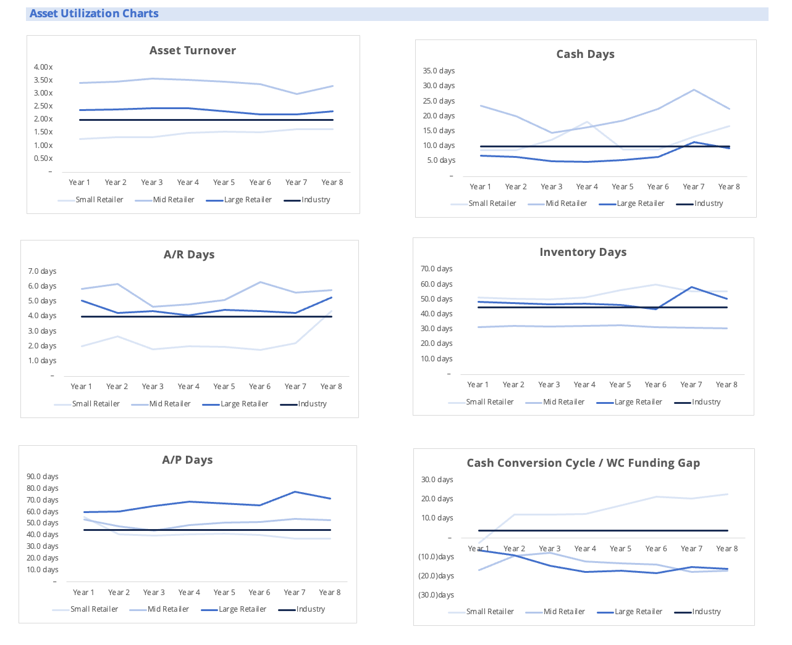
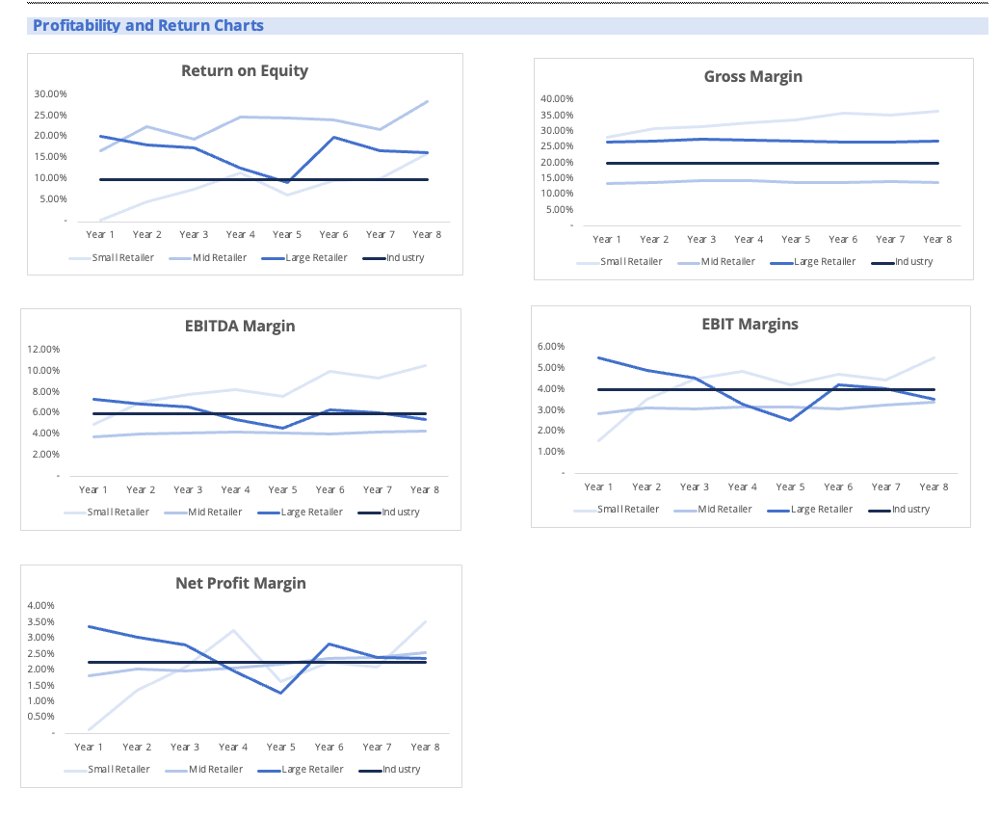

---

### 4. Big Retailer Financial Analysis
3-step and 5-step DuPont decomposition of ROE benchmarked against peers over 8 years, with supporting Growth, Working Capital, and Leverage analysis.

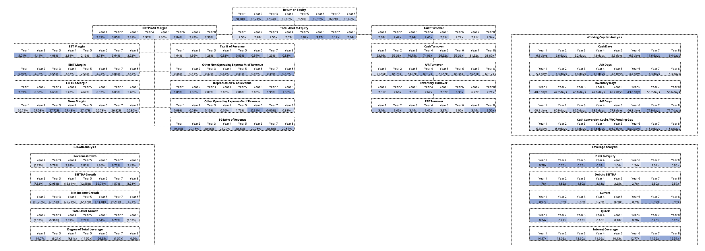
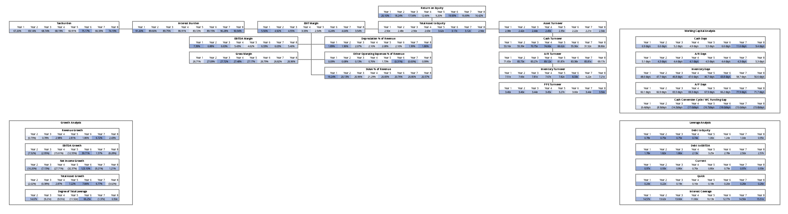

---

### 5. 12-Month Rolling Cash Flow Forecast
Monthly rolling cash flow forecast tracking Operating, Investing, and Financing flows with a debt service ratio covenant monitor (3.0x threshold). Debt Service Ratio breached covenant in Dec 2018.

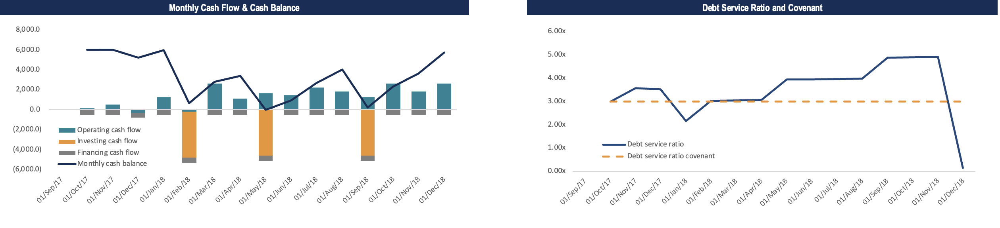

---

### 6. Sensitivity Analysis
Tornado chart ranking the impact of Revenue, COGS, EV/EBITDA, and Discount Rate on implied share price. Revenue drives the largest impact at ±55%.

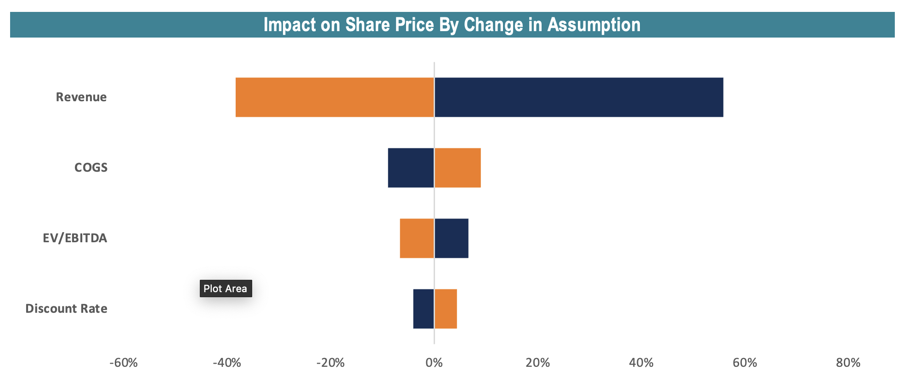

---

### 7. Budget vs. Actual Dashboard
Dynamic monthly variance dashboard with automatic absolute and percentage variance calculation, conditional formatting, and charts. March savings came in at $1,560 vs. $532 budgeted (+193%).

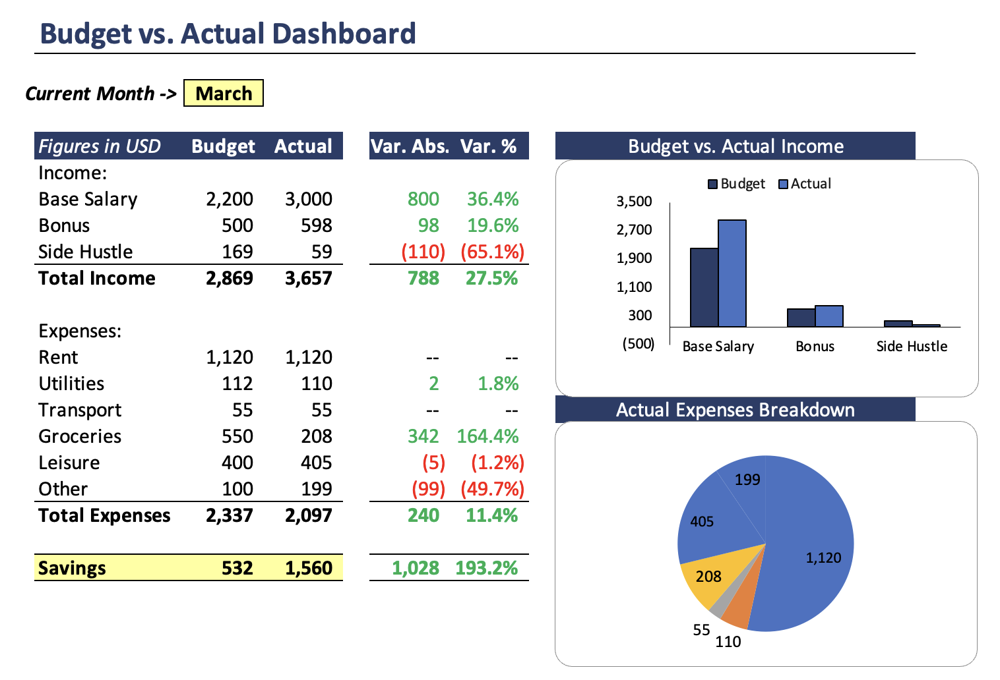

---

## Skills

`Excel` `DCF Valuation` `WACC` `3-Statement Modeling` `Scenario Analysis` `Sensitivity Analysis` `Peer Benchmarking` `DuPont Analysis` `Cash Flow Forecasting` `Variance Analysis` `FP&A` `Data Visualization`
